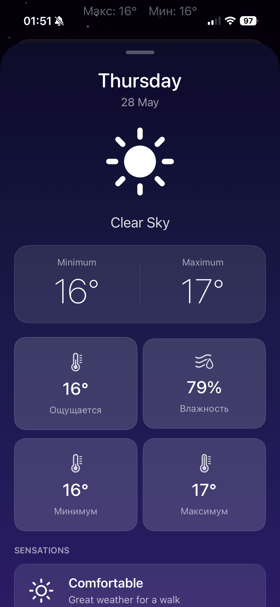
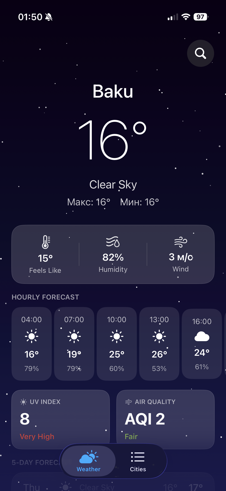

# Aura Weather

Aura Weather is a beautiful, modern weather application for iOS built with SwiftUI. Now with Version 2, Aura Weather brings a richer experience, multi-language support, saved cities, enhanced hourly forecasts, air quality details, and smart notifications.

---

## What’s New in Version 2

- **Multi-language Support:** Available in English and Russian, using iOS localization.
- **Saved Cities Tab:** Fully-featured Cities interface — save, view, and manage favorite locations with real-time weather updates for each.
- **Hourly Weather Forecast:** View detailed hourly breakdowns of temperature and conditions.
- **UV Index & Air Quality:** Stay safe with health-centric metrics derived right in the app.
- **Smart Weather Notifications:** Get alerts for rain, cold snaps, or heat waves based on your location or chosen city.
- **Modernized UI:** Updated, visually appealing card layouts with improved accessibility and polish.
- **Improved Architecture:** Clean, maintainable, and testable SwiftUI + Combine structure with expanded localization capabilities.
- **Persistent Favorites:** Saved cities are stored locally and preserved across app launches.
- **Enhanced Data Sources:** Real-time fetch and display of UV Index and Air Quality Index from OpenWeather.

---

## Key Features

- **Live Animated Interface:** Dynamic backgrounds and particle effects that adapt to weather conditions and time of day.
- **Current & Forecast Weather:** Instant access to present conditions, “feels like”, humidity, wind, and a 5-day forecast, including detailed daily and hourly views.
- **Location and City Search:** Instantly get weather for your current location or search for any world city.
- **Health & Comfort Insights:** View UV levels, air quality, pressure, and tailored comfort tips.
- **Notifications:** Timely push notifications for rain, cold, or extreme heat.

---

## Technical Stack

- **Language & UI:** Swift, SwiftUI
- **Reactive Model:** Combine (`@ObservableObject`, `@Published`)
- **Location:** CoreLocation (with permissions and error fallback)
- **Networking:** URLSession, async/await
- **Notifications:** UserNotifications framework
- **Local Storage:** UserDefaults for favorites
- **API Provider:** [OpenWeatherMap](https://openweathermap.org/)
- **Internationalization:** Localizable.strings (English and Russian)

---

## App Architecture

- **WeatherService.swift:** Manages all weather, forecast, air quality, and UV index data, saved cities, local storage, and permission logic.
- **ContentView.swift:** Tab-based interface for Weather and Saved Cities.
- **CitiesView.swift:** UI for managing favorite/saved locations.
- **WeatherModels.swift:** Codable models for weather, forecast, air quality, UV, and city data.
- **Localizable.strings:** For multi-language UI.

---

## Getting Started

1. **Clone the repository:**
    ```sh
    git clone https://github.com/rashidiic/AuraWeather.git
    cd AuraWeather
    ```

2. **Get an API Key:**
    - Sign up at [OpenWeatherMap](https://openweathermap.org/) and obtain your key.

3. **Add the API Key:**
    - In the Xcode project, open `WeatherService.swift`.
    - Replace the placeholder in
      ```swift
      private let apiKey = "YOUR_API_KEY_HERE"
      ```
      with your API Key.

4. **Build and Run:**
    - Open `AuraWeather.xcodeproj` in Xcode.
    - Select your simulator or device, and run the app.

---

## Screenshots


*Detailed daily weather view (Version 2)*


*Main screen with hourly forecast, UV, and AQI support (Version 2)*


*Detailed daily weather view (Version 2)*


*Main screen with hourly forecast, UV, and AQI support (Version 2)*

---

## Credits

Weather data provided by [OpenWeatherMap](https://openweathermap.org/)

---

## License

Aura Weather is released under the MIT license.
